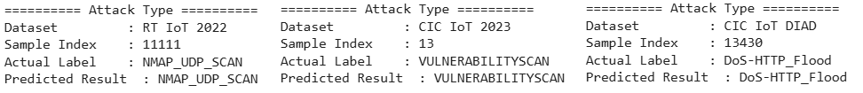

# Development of an IDS on IoT Networks Based on Machine Learning

This project presents the development of an Intrusion Detection System (IDS) for Internet of Things (IoT) networks using three different machine learning models: **XGBoost**, **FastAI**, and **TabNet**. The models are evaluated on three publicly available datasets: **RT IoT 2022**, **CIC IoT 2023**, and **CIC IoT DIAD**.

## Overview

The objective is to compare the performance of the models in detecting multiple classes of network intrusions using three primary evaluation metrics: **Accuracy**, **F1-score**, and **Precision**. In addition, a statistical **ANOVA test** is conducted to determine if the observed differences are statistically significant.

## Dataset Summary

- **RT IoT 2022**: class-balanced via undersampling
- **CIC IoT 2023**: Complex dataset with 6 dominant classes retained after filtering
- **CIC IoT DIAD**: Large-scale dataset, class-balanced via fixed sampling

## Algorithms Used

- **XGBoost**: Tree-based ensemble method optimized for tabular data
- **FastAI**: Tabular neural network built with PyTorch
- **TabNet**: Deep learning model with attention-based feature selection

## Evaluation Metrics

Three metrics were used to evaluate model performance:
- **Accuracy**: Proportion of correct predictions
- **F1-score**: Harmonic mean of precision and recall
- **Precision**: Proportion of true positive predictions among all positive predictions

## Results

### Accuracy Comparison

- **XGBoost** consistently achieved the highest accuracy across all datasets.
- The most challenging dataset was CIC IoT 2023, with XGBoost scoring 91.82%.
- On RT IoT 2022, all models performed well (accuracy > 97%).

### F1-Score Comparison

- **XGBoost** recorded the highest F1-score across all datasets.
- FastAI showed competitive performance, especially on CIC IoT DIAD.
- TabNet consistently scored the lowest.

### Precision Comparison

- **XGBoost** achieved the highest precision on RT IoT 2022: 0.9985.
- FastAI slightly outperformed XGBoost on CIC IoT 2023 and DIAD.
- TabNet scored the lowest for all algorithm.

## ANOVA Statistical Analysis

A one-way ANOVA test was applied to the metric results:

- **Precision** exhibited a statistically significant difference among the evaluated models (p = 0.042 < 0.05). This implies that the models vary in their ability to minimize false positives when identifying attacks. Therefore, precision serves as a distinguishing metric for model performance in this context.
- In contrast, the **accuracy** and **F1-score** metrics showed no statistically significant differences (p > 0.05), suggesting that the overall predictive performance and the balance between precision and recall were generally consistent across the models. This indicates that, from a broader classification perspective, the models demonstrate comparable generalization capabilities.

## Intrusion Detection System Deployment

The trained XGBoost model was implemented into a real-time IDS. Below is a sample output of the classification result on three datasets:

The IDS correctly identified the attack type, matching the ground truth label.

## Conclusion

- **XGBoost** performed the best overall, demonstrating high generalization across datasets.
- **FastAI** showed strong performance on more complex data (e.g., CIC IoT DIAD).
- **TabNet** requires more tuning or larger datasets for optimal performance.
- The ANOVA test suggests that **precision** is a statistically significant distinguishing metric between models.

## Citation

The following references were used in this study and are recommended for citation when referring to the datasets:

[1] B. S. and R. Nagapadma, *RT-IoT2022*, UCI Machine Learning Repository, 2023. [DOI: 10.24432/C5P338](https://doi.org/10.24432/C5P338)

[2] Canadian Institute for Cybersecurity, *CIC IoT Dataset 2023*, University of New Brunswick, 2023. [Online]. Available: [https://www.unb.ca/cic/datasets/iotdataset-2023.html](https://www.unb.ca/cic/datasets/iotdataset-2023.html)

[3] Canadian Institute for Cybersecurity, *CIC IoT DIoT and DIAD Dataset 2024*, University of New Brunswick, 2024. [Online]. Available: [https://www.unb.ca/cic/datasets/iot-diad-2024.html](https://www.unb.ca/cic/datasets/iot-diad-2024.html)

